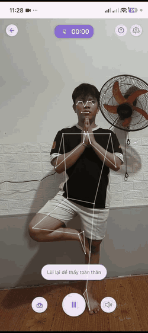
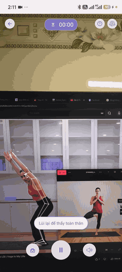
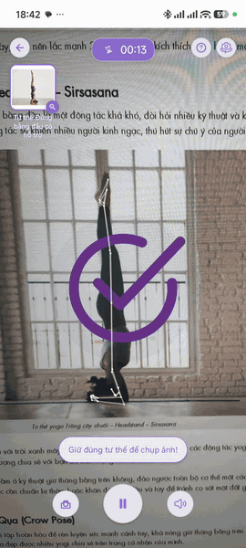
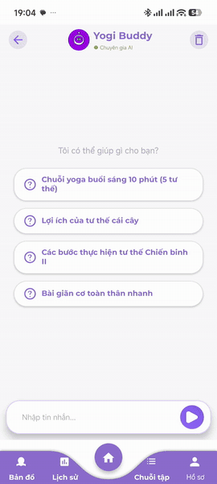
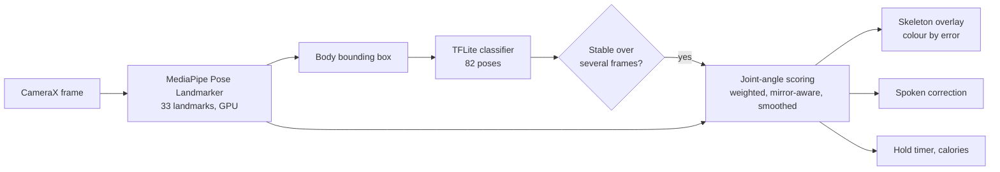
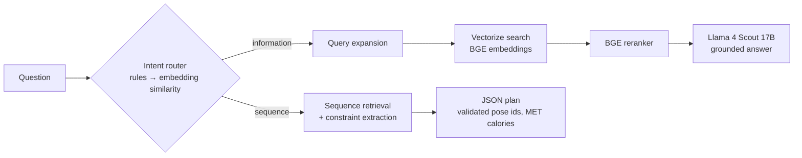

<div align="center">

# 🧘 Yoga AI

**Real-time AI yoga coach on Android — computer vision on the phone, a RAG chatbot in the cloud.**

*Graduation thesis · Da Nang University of Science and Technology*


</div>

---

## Demo

| AI coach | Pose recognition | Results & sharing | AI chatbot |
|:---:|:---:|:---:|:---:|
|  |  |  |  |
| Skeleton overlay and live corrections while holding a pose | Recognises the pose and starts the timer once it is held | Calories, time and accuracy, then share the photo to the yoga map | Answers pose questions and builds a sequence with calories |
| [▶ Full video](docs/media/ai-coach.mp4) | [▶ Full video](docs/media/pose-detection.mp4) | [▶ Full video](docs/media/result-share.mp4) | [▶ Full video](docs/media/chatbot.mp4) |

## Highlights

- **On-device pose recognition** — MediaPipe Pose Landmarker finds 33 body landmarks in real time; the body is cropped from them and classified by a TensorFlow Lite model across **82 yoga poses**. Nothing leaves the phone.
- **Joint-angle coaching** — the pose is scored from the angles between joint vectors against a reference, weighted by joint group, mirror-aware (left/right swapped poses still match) and smoothed over time. Feedback comes as a colour-coded skeleton and spoken cues.
- **Hierarchical pose classifier** — DenseNet-121 trained with transfer learning on Yoga-82 with three output heads (6 / 20 / 82 classes): **87.77% top-1 and 96.44% top-5** on the 82-class test set.
- **RAG chatbot "Yogi Buddy"** — answers questions about poses and generates practice sequences grounded in a curated pose database, with validated JSON output so the app only ever receives poses that exist. Backend: [**YogaAi_Chatbot**](https://github.com/hadatttt/YogaAi_Chatbot).
- **Full practice app** — pose library, single / multi-pose / guided sessions, custom and community sequences, workout history with charts, a health profile (BMI, BMR, TDEE), a map of yoga spots, daily reminders, English and Vietnamese.

## How it works

### Real-time coaching pipeline (on the phone)



- The classifier only switches pose after several consecutive confident predictions, so the coach does not flicker between poses.
- Eight joint angles (knees, hips, shoulder–torso, elbows) are compared with the reference pose; the joint with the largest error becomes the spoken cue (for example "lower your left arm").
- Inference runs on its own thread and the thread count and classifier interval adapt to the device's RAM and CPU cores.

### Pose classification model

| Level | Classes | Test accuracy |
|---|:---:|:---:|
| Body position | 6 | 94.33% |
| Pose family | 20 | 91.16% |
| **Yoga pose** | **82** | **87.77% top-1 · 96.44% top-5** |

DenseNet-121 backbone fine-tuned on a cleaned Yoga-82 split (13,794 train / 1,691 validation / 1,799 test images). The three heads are trained jointly so the coarse levels guide the fine-grained one. Macro F1 on the 82 classes: 0.865.

### AI chatbot (Cloudflare Workers AI)



The app sends the question and the user's weight; the worker returns either a grounded answer or a sequence plan that the app renders as a ready-to-start workout. Source and details: [**hadatttt/YogaAi_Chatbot**](https://github.com/hadatttt/YogaAi_Chatbot).

## Tech stack

| Area | Technologies |
|---|---|
| App | Kotlin, MVVM, Navigation Component, Coroutines, ViewBinding |
| Computer vision | CameraX, MediaPipe Tasks Vision, TensorFlow Lite |
| Model training | TensorFlow / Keras, DenseNet-121, Kaggle |
| Data | Firebase Auth (Google Sign-In), Cloud Firestore, Remote Config, Room |
| Chatbot | Cloudflare Workers AI, Vectorize, D1, Llama 4 Scout, BGE embeddings and reranker |
| Other | Google Maps, Cloudinary, WorkManager, MPAndroidChart, Lottie |

## Project structure

```
aiyoga/      Android app
  yoga_ai/        AI camera: CameraX + MediaPipe + TFLite classifier
  yoga_single/    single-pose AI practice
  yoga_multi/     multi-pose sequence practice
  chatbot_ai/     Yogi Buddy chatbot screen
  utils/yogautils joint-angle scoring, pose landmarker, recommender
  ...             library, sequences, community, map, history, profile
base/        shared Android framework (base fragment, view model, adapters, navigation)
ucrop/       image cropping module
```

## Getting started

1. Open the project in Android Studio (JDK 17 or newer, Android SDK 36).
2. Build and install the debug app:
   ```bash
   ./gradlew :aiyoga:installDebug
   ```
3. On first launch the app downloads the pose models (TFLite classifier and MediaPipe landmarker) and the pose data from Firebase Remote Config, so an internet connection is needed once.

The AI camera needs a phone with an `arm64-v8a` CPU (MediaPipe and TFLite ship native code).

## Author

**Hà Văn Khánh Đạt** — Da Nang University of Science and Technology
[hadatalex@gmail.com](mailto:hadatalex@gmail.com) · [github.com/hadatttt](https://github.com/hadatttt)
